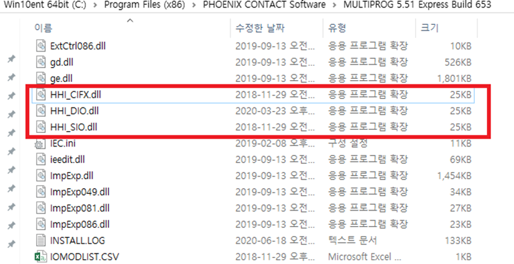

# 1.2 Multiprog

PCI 통신 카드 연결 이후 DIO 데이터 교환을 위해서 사용하는 PLC 프로그램 입니다. (‘3.3 산업용 통신 DIO Block 할당 설정’에서 “**PLC**”로 세팅 후 사용하시기 바랍니다.)

**1.**    현대로보틱스 홈페이지([www.hyundai-robotics.com](http://www.hyundai-robotics.com)) -> 고객지원 -> 응용 소프트웨어 에서 “**Hi6 Multiprog**”을 다운로드 합니다.

**2.**    다음 내용을 따라 설치를 진행 하시면 됩니다.


1. MP5.51 Express.zip 압축풀기
2. MULTIPROG 5.51.msi 실행
   * 설치 시 에러가 발생될 경우 setup.exe로 설치
3. MP eCLR Addon.zip 압축풀기
4. I486\_LE\_GCC3\_eCLR.exe 실행
5. MULTIPROG 5.51 Build 653.zip 압축풀기
6. MULTIPROG 5.51 Build 653 폴더 내 "multiprog\_set\_batch\_express.bat" 파일 실행(관리자 권한으로 실행)

*   프로젝트 빌드에 문제 있을 경우 다음과 같이 추가 작업 : MULTIPROG 5.51 Build 653내의 파일들이 제대로 복사가 안되었을 수 있습니다.

    \-> MULTIPROG 5.51 Build 653 폴더의 모든 파일을 MULTIPROG 설치 경로의 같은 폴더안에 복사 : MULTIPROG 5.51 Build 653내의 파일을 아래의 'Default 설치'위치를 찾아가서 붙여넣기

    * Default 설치 : C:\Program Files (x86)\PHOENIX CONTACT Software\MULTIPROG 5.51 Express Build 653 폴더에 복사(덮어쓰기 3개 파일)

\*\*확인 방법\*\*

\-> Default 설치(혹은 설치위치) 위치의 다음 파일들 확인



(만약 Pro 버전사용을 원하신다면 “**Hi6 MultiProg 개발환경 설치 안내.pdf**”를 이용하여 설치 하시기 바랍니다. 단, License가 필요하니 현대로보틱스 본사에 요청하여 따로 구매 하시기 바랍니다. License가 없을 경우 Pro 버전은 30일만 사용가능하니 참고 바랍니다.)
