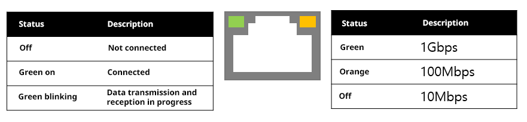

## 2.2 EtherNet/IP适配器网络设置

**2.2.1 Hi6 Com**
可与EtherNet/IP适配器连接的LAN Port为LAN1/ LAN2/ LAN3。 

 
*[图2.2.1 Hi6 Com]* 

**2.2.2 网络设置**
选择所要连接EtherNet/IP通信的LAN Port后，请通过如下TP界面确认该LAN Port的设置，并根据需要更改设置。 

 
*[图2.2.2 网络设置]* 


\.      LAN1/LAN2/LAN3各个IP地址的子网部分必须设置为不同。

\.      更改设置后，请重启机器人控制器。


**2.2.3 连接状态确认**
可以根据LAN端口的Link/Act Led状态，确认与EtherNet/IP扫描器的物理连接状态。 

 
*[图2.2.3 LAN端口]* 

用LAN线连接EtherNet/IP适配器和扫描器后，确认LED的状态。如果左侧的LED不点亮或不闪烁，则表示电缆或适配器或扫描器设备可能存在异常。请确认电缆或设备的连接状态。 

**2.2.4 网络构成**
建议将EtherNet/IP Network与Factory Network构建为相互分离的网络。如下图所示，若将EtherNet/IP Network与Factory Network构建为一个网络，则将共享一个传输介质，从而会增加网络负载。因此，建议尽可能使用单独构建的网络作为EtherNet/IP Network。 

 
*[图2.2.4 未分离的网络]* 

 
*[图2.2.5 已分离的网络]* 
