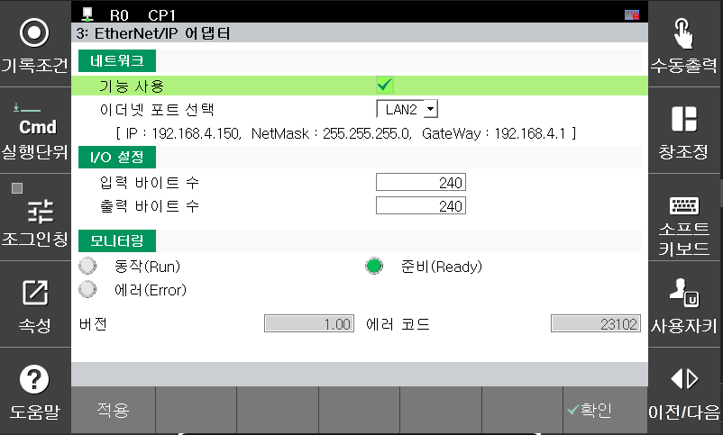

## 2.3 EtherNet/IP-Adapter

**2.3.1 Technische Daten des EtherNet/IP-Adapters**
|Merkmal|Beschreibung|
|------|---|
|Gerätetyp|Allzweck-Diskret-E/A (7)|
|Eingangs-Assembly-Instanz|100|
|Ausgangs-Assembly-Instanz|112|
|Eingangsgrößenbereich (Bytes)|0 - 240|
|Ausgangsgrößenbereich (Bytes)|0 - 240|
|RPI-Bereich (ms)|5 – 3000| 

**2.3.2 Einstellungen und Überwachung des EtherNet/IP-Adapters über das Teach-Pendant**
Navigieren Sie vom Startbildschirm zu „SYSTEM“ > „Steuerungsparameter“ > „Industrielle Kommunikation“ > „Ethernet/IP-Adapter“. 
 
*[Abbildung 2.3.1 Einstellungen]* 

**[Network]**
-	Funktionsverwendung: Wählen Sie aus, ob der Ethernet/IP-Adapter verwendet werden soll.
-	Auswahl des Ethernet-Ports: Wählen Sie den LAN-Port aus, der mit dem Ethernet/IP-Scanner verbunden werden soll (Informationen zum ausgewählten LAN-Port werden in der Zeile direkt darunter angezeigt). 

**[I/O Size]**
-	Eingangsbytes: 0 bis 240 konfigurierbar
-	Ausgangsbytes: 0 bis 240 konfigurierbar 

**[Monitoring]**
- Run (Ausführen): Zeigt den Status des E/A-Datenaustauschs von Ethernet/IP an (Ein: Normale Kommunikation, Aus: Keine Kommunikation)
- Ready (Bereit): Zeigt den Initialisierungsstatus des Ethernet/IP-Adapters an (Ein: Initialisierung normal, Aus: Initialisierung anormal)
- Error (Fehler): Zeigt den Alarm- oder Warnstatus des Ethernet/IP-Adapters an (Ein: Alarm-/Warnstatus, Aus: Normal)
- Version: Zeigt Informationen zur Softwareversion des Ethernet/IP-Adapters an
- Fehlercode: Zeigt den Alarm- oder Warncode an, wenn ein Alarm oder eine Warnung auftritt 
