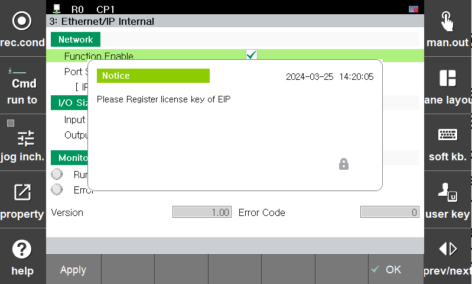

## 2.5 EtherNet/IP 어댑터 라이선스
### 2.5.1 라이선스의 활성화
초기화면에서 “시스템” > “2 : 제어 파라미터” > “10: 옵션기능의 라이선스키 등록” 으로 이동 
 
*[그림 2.5.1-1 라이선스 활성]* 

1. 라이선스 리스트 중 “EtherNet/IP 어댑터를 “유효”로 선택
2. 시스템 일련번호를 라이선스 관리자에게 전달
3. 관리자로부터 라이선스키를 얻어 입력 후 “확인”버튼을 누름
4. License Key [XXXXXX] ==>OK 확인
5. Ethernet/IP 어댑터 메뉴 진입시 라이런스 없다는 경고 메시지가 사라진 것을 확인 
~ 참고 
 
*[그림 2.5.1-2 라이선스 활성화 안될시 나오는 메시지]* 

