### 2.6.1 与LS ELECTRIC PLC连接

说明LS ELECTRIC PLC与Hi6 EtherNet/IP的连接方法。
下面所使用的PLC及通信模块如下。
（PLC：XGI-CPUS，通信模块：XGL-EFMTB）

#### 2.6.1.1 XG5000执行
  
* [图2.6.1.1 XG5000执行]* 
关于XG5000程序的下载及详细使用方法，请参考LS ELECTRIC官网。

#### 2.6.1.2 EDS File注册
请选择：菜单 > 工具 > EDS(D) > 点击注册EDS文件 > “Hi6_EIP_240402.eds” 
如下图所示，确认EDS文件注册 
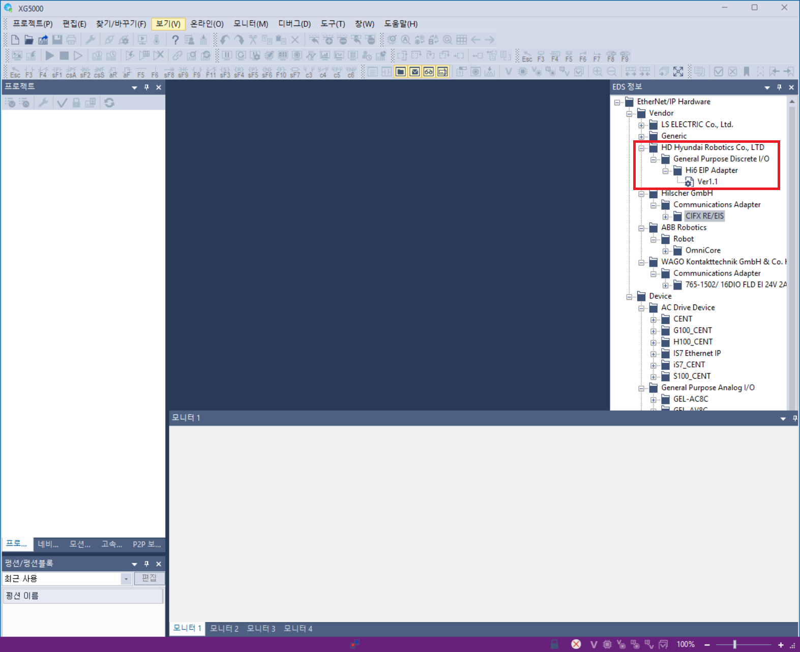 
* [图2.6.1.2 EDS File注册]* 

#### 2.6.1.3 设备连接
[1] 创建项目 
 
* [图2.6.1.3 创建新项目]* 

[2] 添加通信模块 
 
* [图2.6.1.4 添加通信模块1]* 

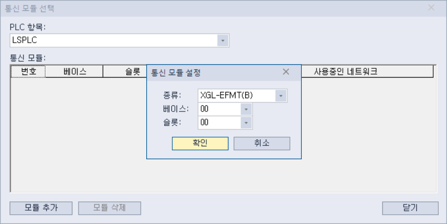 
* [图2.6.1.5 添加通信模块2]* 

 
* [图2.6.1.6 添加通信模块3]* 

[3] 通信模块设置  
双击下图左侧标签中显示的XGL-EFMT 
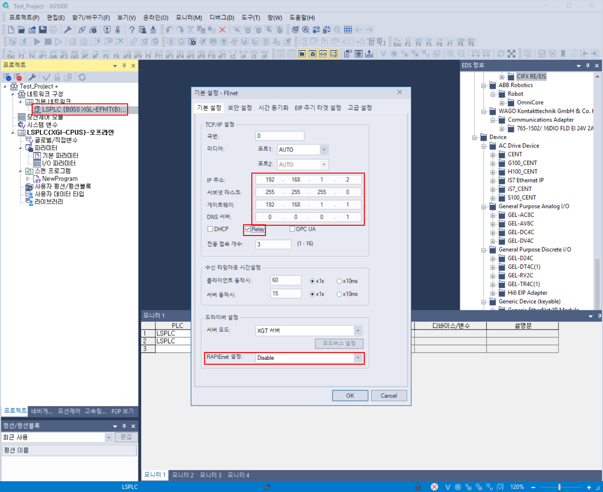 
* [图2.6.1.7 通信模块设置]* 
- 设置IP地址、子网掩码、网关等。
- 若要将PLC的2个LAN Port作为继电器功能使用，请选择“Relay”复选框。
- 将RAPIEnet设置更改为Disable。

#### 2.6.1.4 在线连接设置
[1] 用USB电缆连接PLC。 
 
* [图2.6.1.8 在线连接设置1]* 

[2] 按下如下图左侧所显示的按钮来下载全部设置。 
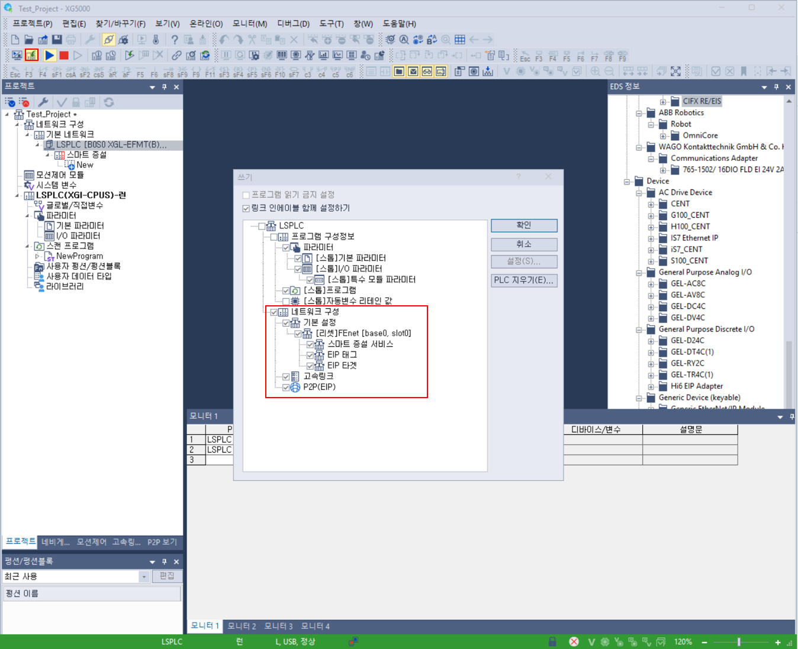 
* [图2.6.1.9 在线连接设置2]* 

#### 2.6.1.5 自动扫描
[1] 自动扫描在与PLC连接状态下才可用。 
当前不是在线状态时，则需点击“菜单 > 在线 > 连接”来更改为在线状态。 

[2] 在XGL-EFMT上右击鼠标 > 添加项目 > 点击智能扩展 
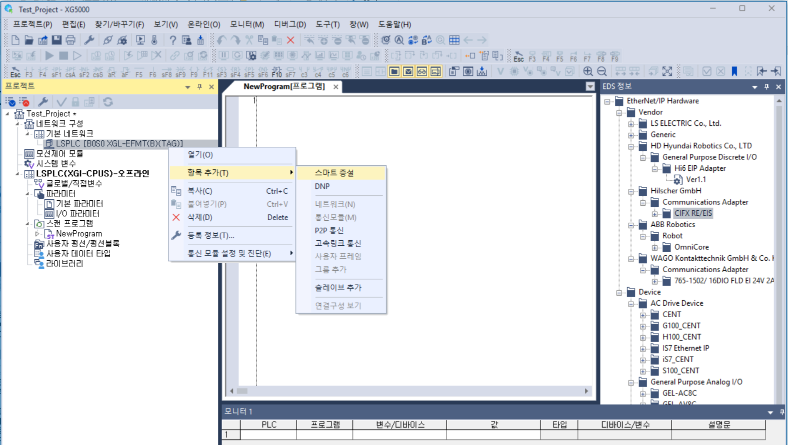 
* [图2.6.1.10 自动扫描1]* 

[3] 点击Next  
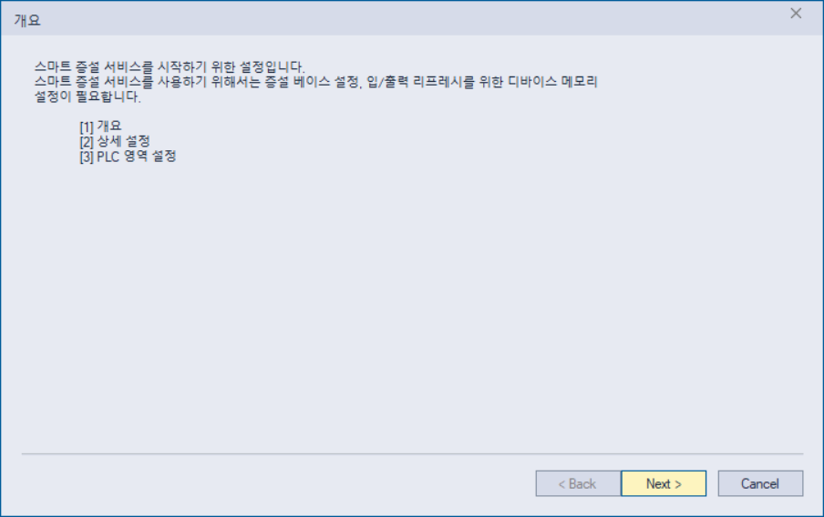 
* [图2.6.1.11 自动扫描2]* 

[4] 点击自动扫描  
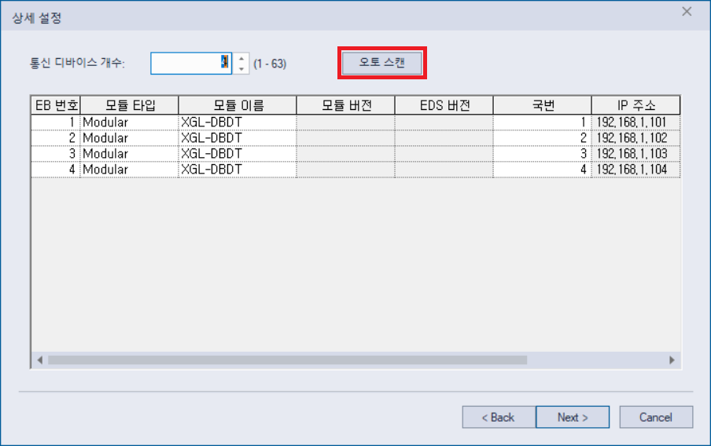 
* [图2.6.1.12 自动扫描3]* 

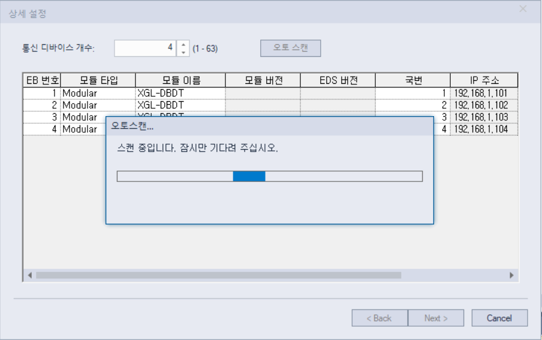 
* [图2.6.1.13 自动扫描4]* 

[5] 确认自动扫描的设备
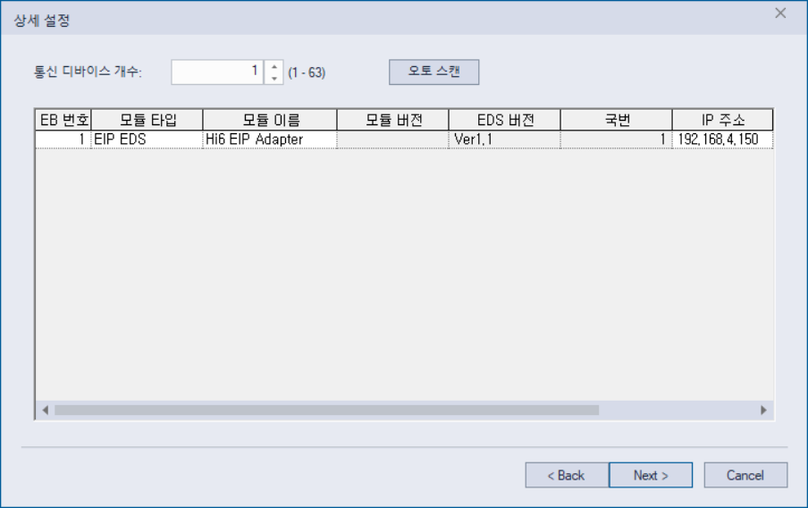 
* [图2.6.1.14 自动扫描5]* 

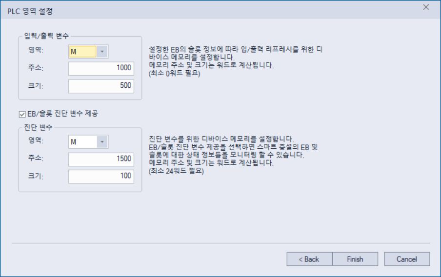 
* [图2.6.1.15 自动扫描6]* 

如下图所示，Hi6 EtherNet/IP适配器设备将出现在列表中。  
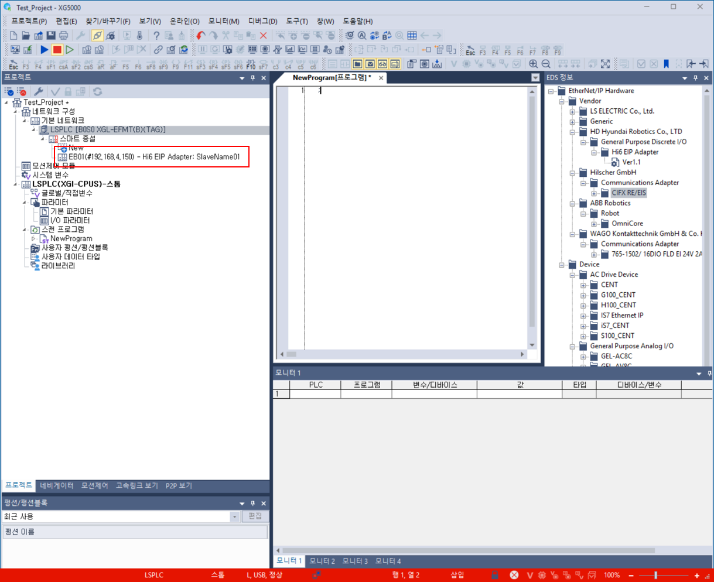 
* [图2.6.1.16 自动扫描7]* 

#### 2.6.1.6 程序变量注册
[1] 扫描程序 > NewProgram > 局部变量（双击） 
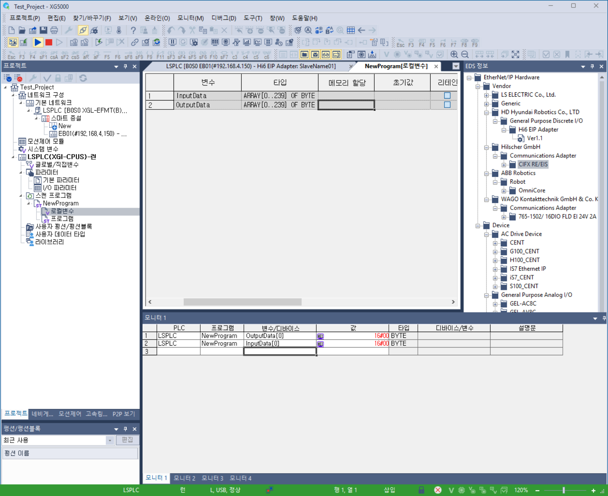 
* [图2.6.1.17 变量注册1]* 

[2] 设置所要在通信中使用的Input/Output Data。 
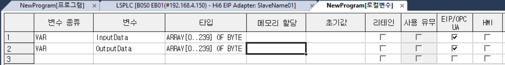 
* [图2.6.1.18 变量注册2]* 

#### 2.6.1.7 EtherNet/IP Adapter设置
[1] 请在左侧列表中双击EB01（Hi6 EtherNet/IP适配器）。 

[2] 按下EIP详细设置按钮。 
 
* [图2.6.1.19 EtherNet/IP Adapter设置1]* 

[3] 请参考下图来选择EtherNet/IP适配器的设定值。  
- 连接形态
- T2O RPI Range, O2T RPI Range
- T2O Input, O2T Output size
- 发送周期
- 超时
- 本地标签、远程标签  
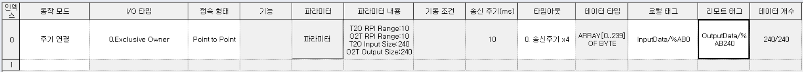  
* [图2.6.1.20 EtherNet/IP Adapter设置2]* 

[4] 请点击：在线 > 通信模块设置及诊断 > 服务使能 
 
* [图2.6.1.21 EtherNet/IP Adapter设置3]* 

[5] FEnet的I/O服务勾选确认 
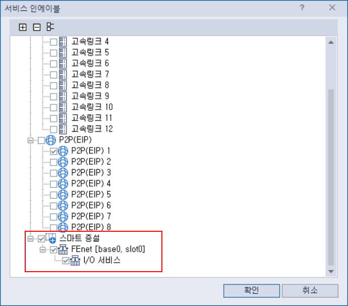 
* [图2.6.1.22 EtherNet/IP Adapter设置4]* 

 

##### 2.6.1.8 通信设置完成后分配IO Block


\.      **통신 설정 완료 후 IO Block 을 할당하여 입출력 신호를 사용할 수 있습니다.  (“[\.      **通信设置完成后，可以通过分配IO Block来使用输入输出信号。请确认（“**4. 工业通信IO Block分配**”）。**](../../4-io-block-allocation.md)”)를 확인해 주십시오.**
