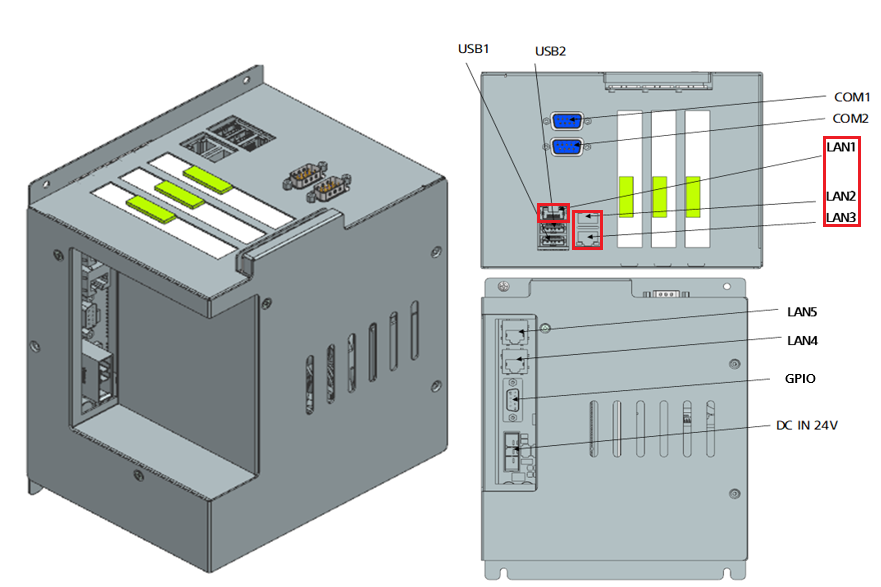
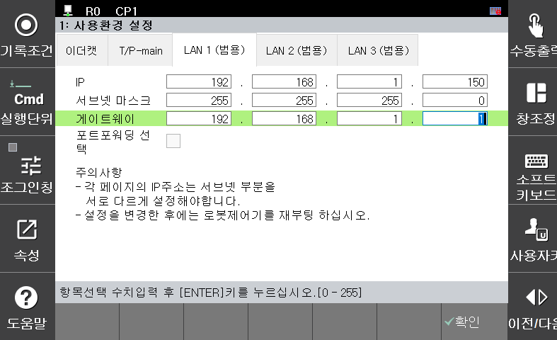
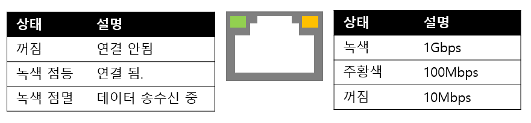
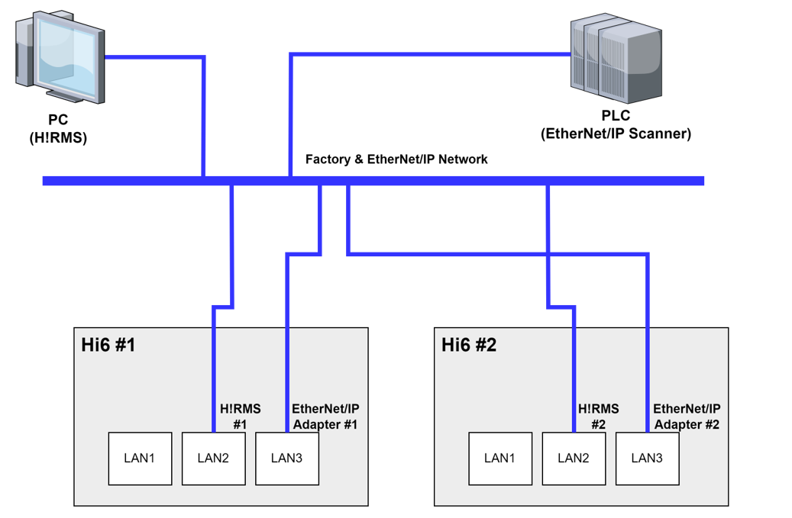
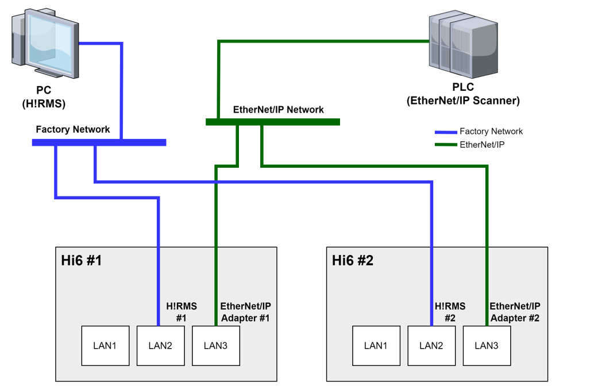

## 2.1 네트워크 설정

**1. 제어기 메인 모듈**

 

EtherNet/IP 통신을 사용할 수 있는 LAN Port는 LAN1/ LAN2/ LAN3 입니다.

 

 

**2. 네트워크 설정**

 

EtherNet/IP 통신을 연결할 LAN Port를 선택한 뒤 아래와 같이 TP화면을 통해 해당 LAN Port의 설정을 확인하고 필요에 따라 설정을 변경해야 합니다.

 

 


   - LAN1/LAN2/LAN3 각각의 IP주소는 서브넷 부분을 다르게 설정해야 합니다.

   - 설정을 변경한 후에는 로봇제어기를 재부팅 하십시오.


 

**3. 연결 상태의 확인**

 

랜 포트의 Link/Act Led로 물리적 연결 상태를 확인할 수 있습니다.

 

LAN선을 연결 한 뒤 LED의 상태를 확인합니다. 좌측의 LED가 점등 또는 점멸하지 않는다면 케이블이나 어댑터 또는 스캐너 장치에 이상이 있다는 것을 의미합니다. 케이블이나 장치의 연결상태를 확인하십시오.

 

 

**4. 네트워크 구성**

 

EtherNet/IP Network와 Factory Network는 서로 분리된 네트워크로 구성하는 것이 좋습니다. 아래 그림과 같이 하나의 Network로 EtherNet/IP Network와 Factory Network를 구성하게 되면 하나의 전송 매체를 공유하게 되므로 네트워크 부하를 증가시키게 됩니다. 따라서 가능하면 EtherNet/IP Network는 별도로 구성한 네트워크를 사용하시는 것을 추천 드립니다.

 

 

 
