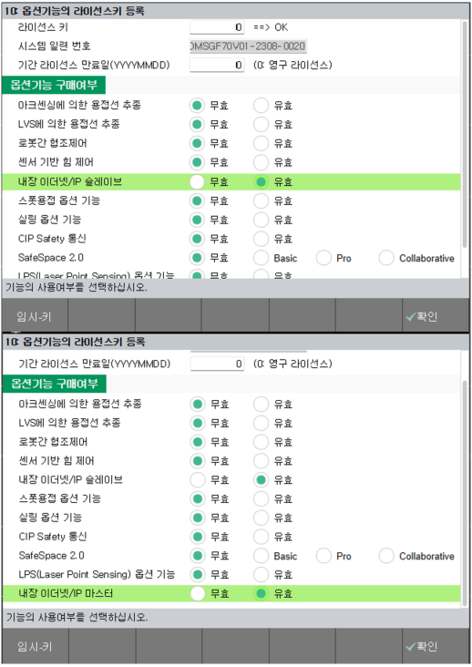

## 2.2 라이선스 설정

**1. 라이선스의 활성화**

 

초기화면에서 "시스템" > "2 : 제어 파라미터" > "10: 옵션기능의 라이선스키 등록" 으로 이동

 

*[그림 2.5.1-1 라이선스 활성]*

 

1. 시스템 일련번호를 라이선스 관리자에게 전달
2. 관리자로부터 라이선스키를 얻어 입력 후 "확인"버튼을 누름
3. License Key [XXXXXX] ==>OK 확인
4. 라이선스 리스트 중 "내장 이더넷/IP 슬레이브" 또는 "내장 이더넷/IP 마스터"를 "유효"로 선택

 


   [EtherNet/IP 라이선스 정책]

   - 슬레이브 라이선스 : EtherNet/IP 슬레이브만 사용 가능

   - 마스터 라이선스 : EtherNet/IP 슬레이브 + 마스터 모두 사용 가능


 