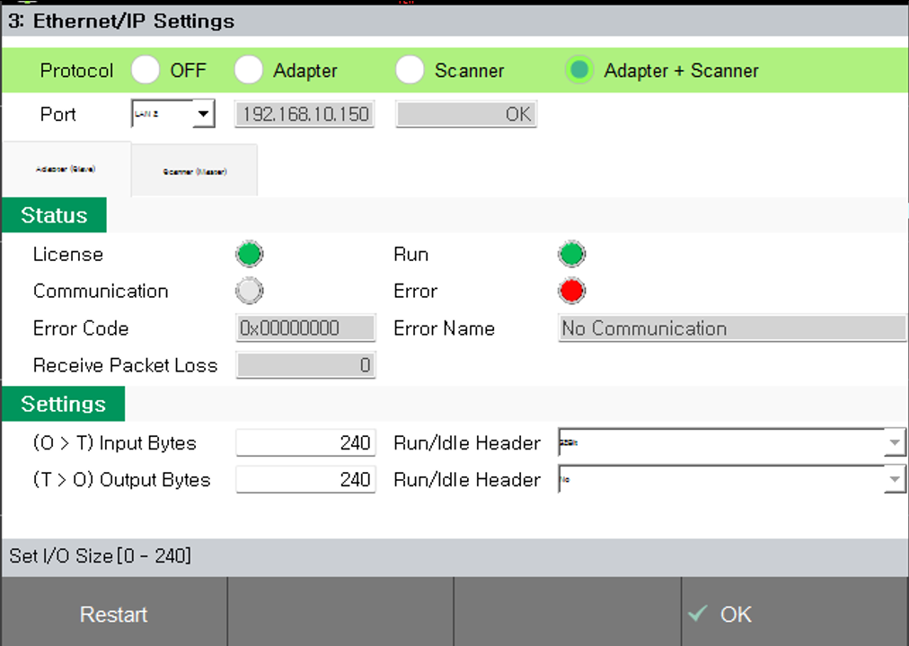

### 2.3.2 EtherNet/IP 어댑터 (슬레이브) 설정

 

**1. 티칭팬던트를 통한 EtherNet/IP 어댑터의 설정 및 모니터링**

 

초기화면에서 "SYSTEM" > "Control Parameter" > "Industrial Communication" > "Ethernet/IP 어댑터" 로 이동

 

 
*[그림 2.3.1 설정]*

 

**[Network]**

-	기능사용 : Ethernet/IP 어댑터의 사용여부 선택
-	이더넷 포트 선택 : Ethernet/IP Scanner와 연결할 LAN Port 선택 (선택된 LAN Port의 정보는 바로 아래 줄에 표시 됨)

 

**[I/O Size]**

-	입력 바이트 수 : 0 ~ 240 설정 가능
-	출력 바이트 수 : 0 ~ 240 설정 가능

 

**[Monitoring]**

- 동작(Run) : Ethernet/IP의 I/O Data 교환의 상태를 나타냄 (On : 정상 통신 중 , Off : 통신 중 아님)
- 준비(Ready) : Ethernet/IP 어댑터의 초기화 상태를 나타냄 (On : 초기화 정상, Off : 초기화 비정상)
- 에러(Error) : Ethernet/IP 어댑터의 알람 또는 경고 상태 표시 (On : 알람/경고 상태, Off : 정상)
- 버전 : Ethernet/IP 어댑터 S/W 버전 정보 표시
- 에러코드: 알람 또는 경고가 발생했을 경우 알람/경고 코드 표시 
