#### 2.3.3.1 LS ELECTRIC PLC

 

本节解释如何将 LS ELECTRIC PLC 与 EtherNet/IP 连接。  
以下是使用的 PLC 和通信模块。  
(PLC: XGI-CPUS, Communication Module: XGL-EFMTB)

 

**1. XG5000 运行**

 

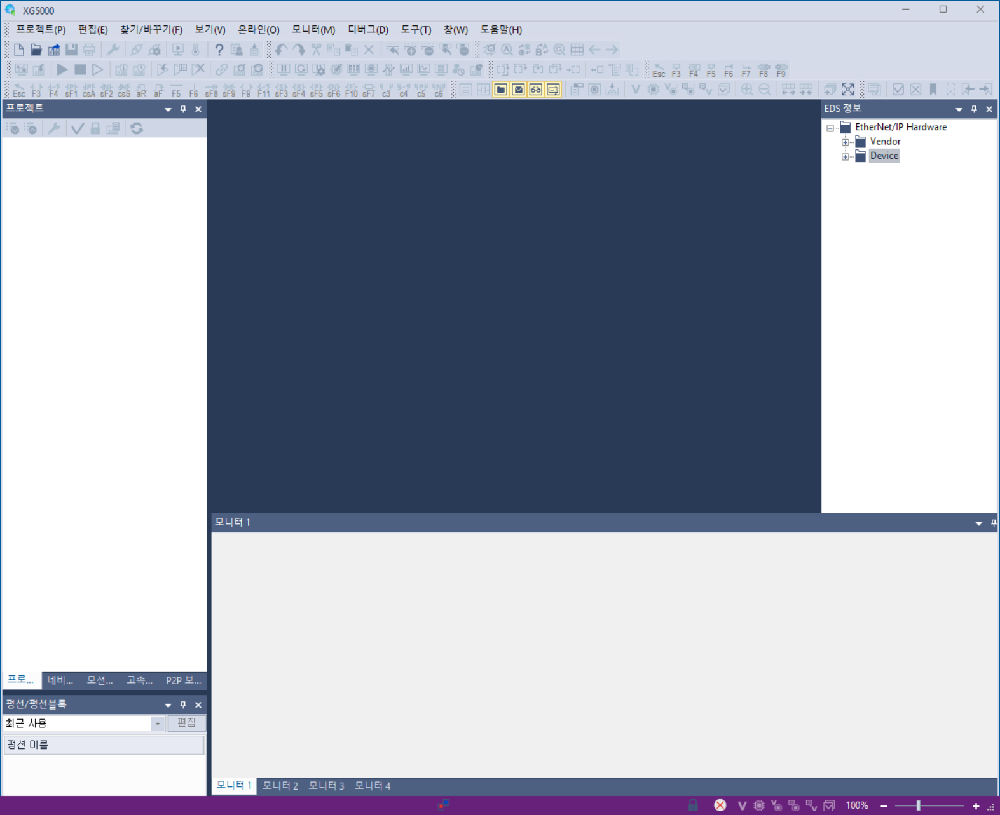

 

要下载 XG5000 程序和详细使用方法，请参阅 LS ELECTRIC 网站。

 

**2. EDS 文件注册**

 

点击菜单 > 工具 > EDS(D) > EDS 文件注册，然后选择 "Hi7_EIP_251023.eds"  
确认如图所示的 EDS 文件注册。

 

 

**3. 设备连接**

 

[1] 创建一个项目。 
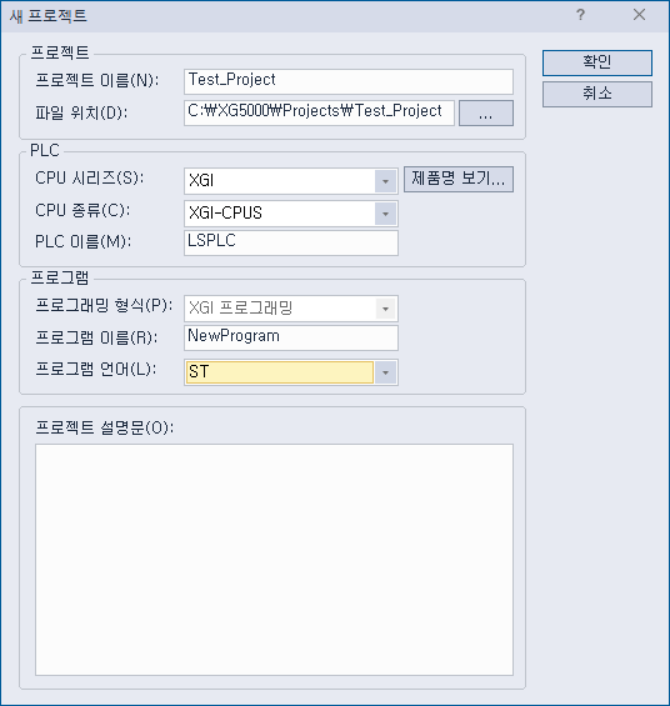 

[2] 添加一个通信模块。 
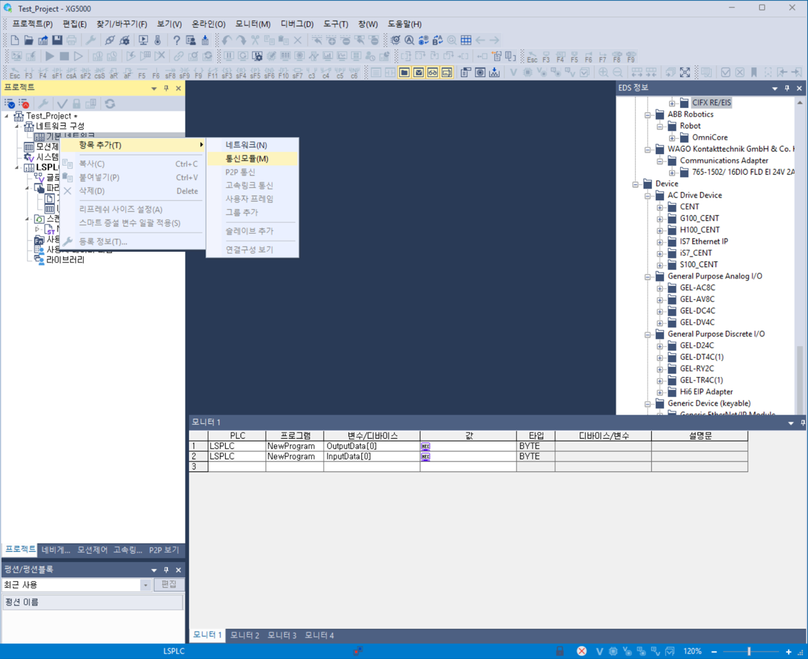 

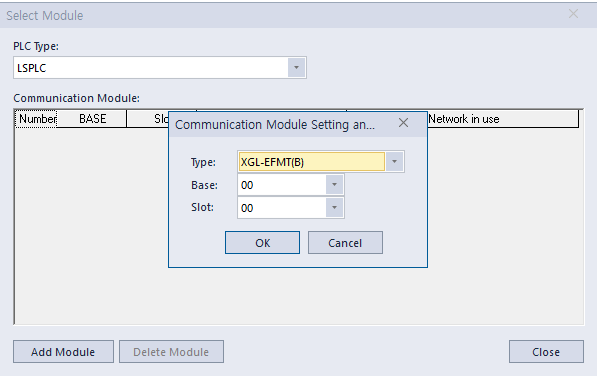 

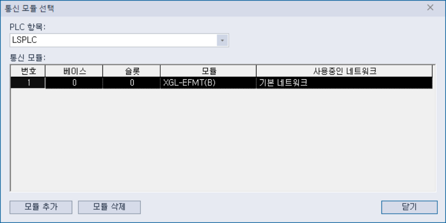 

 

[3] 设置通信模块  
双击下图左侧选项卡中的 XGL-EFMT。 
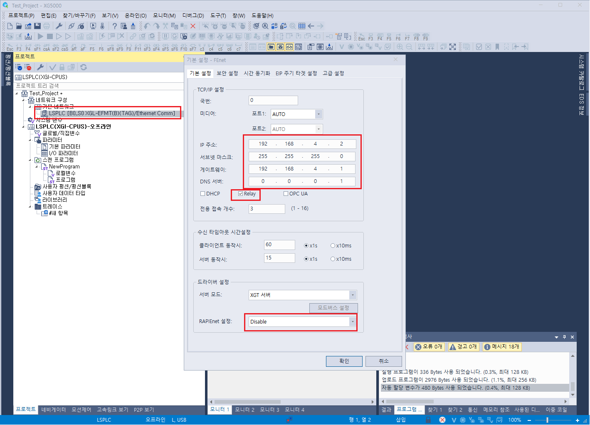

 

- 设置 IP 地址、子网掩码、网关等。  
- 要将 PLC 的两个 LAN 端口用作中继功能，请选择 "中继" 复选框。  
- 将 RAPIEnet 设置更改为禁用。

 

**4. 在线连接设置**

 

[1] 用 USB 电缆连接 PLC。 
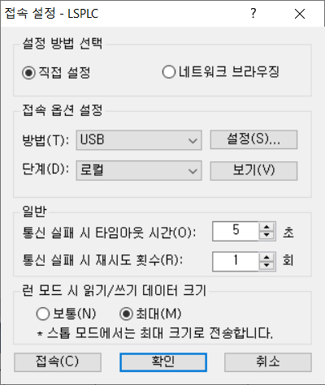 

[2] 按下下图左侧所示的按钮以下载所有设置。 
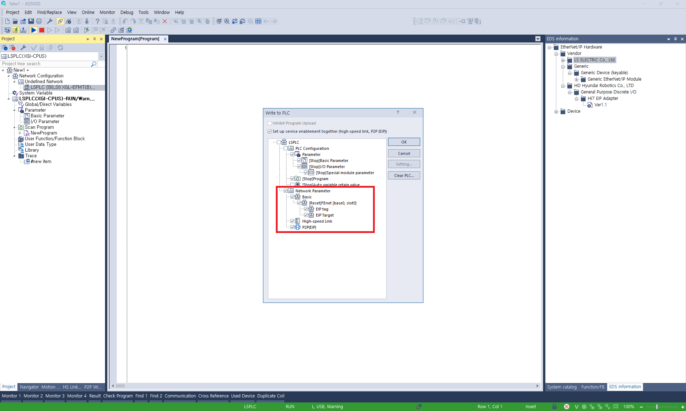 

 

**5. 自动扫描**

 

[1] 连接到 PLC 时可以进行自动扫描。 
如果当前状态不是在线，请点击菜单 > 在线 > 连接以更改为在线状态。 

[2] 右键单击 XGL-EFMT > 添加项目 > 智能扩展 
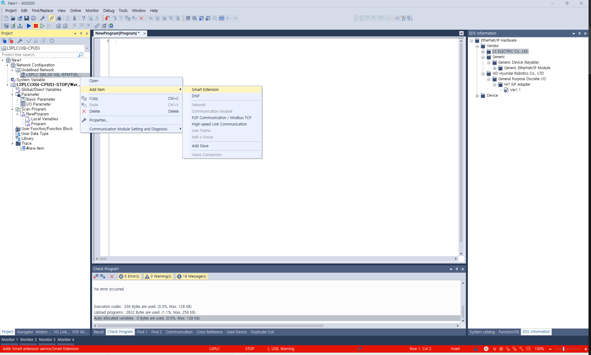 

[3] 点击下一步。  
 

[4] 点击自动扫描。  
 

 

[5] 检查自动扫描到的设备。  
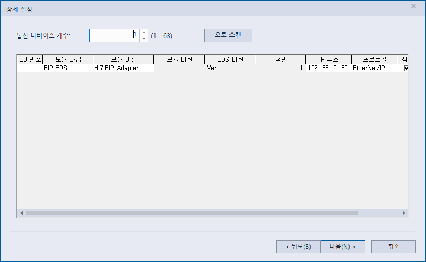 

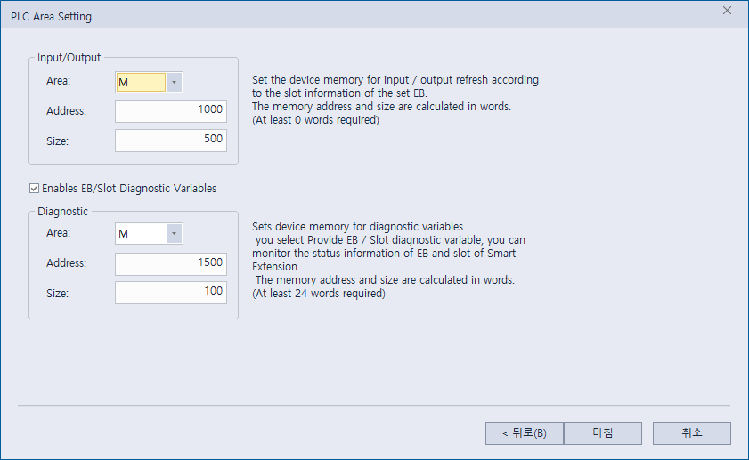 

如图所示，Hi7 EtherNet/IP 适配器设备出现在列表中。  
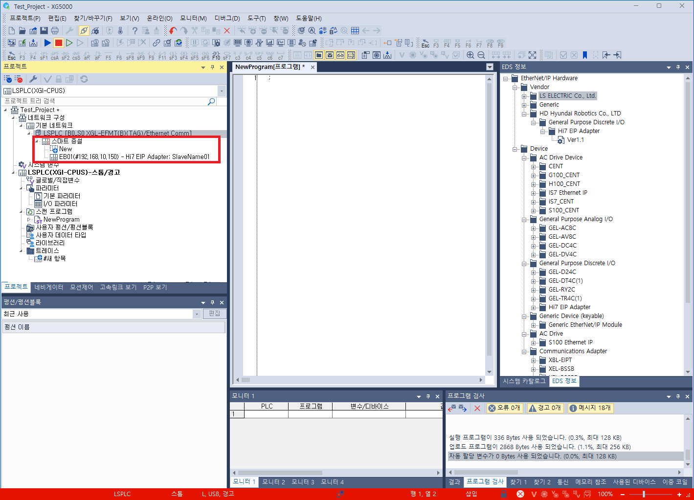 

 

**6. 程序变量注册**

 

[1] 扫描程序 > NewProgram > 本地变量 (双击) 
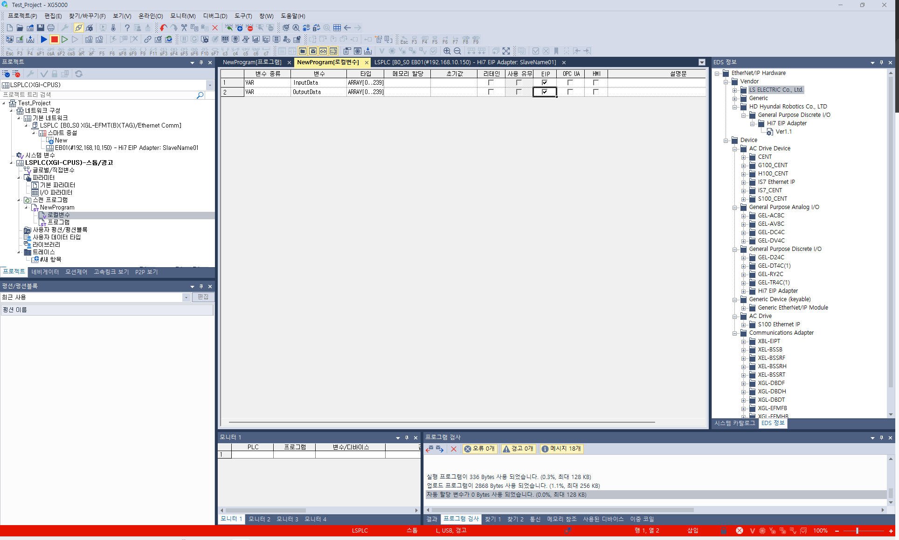 

[2] 设置用于通信的输入/输出数据。 
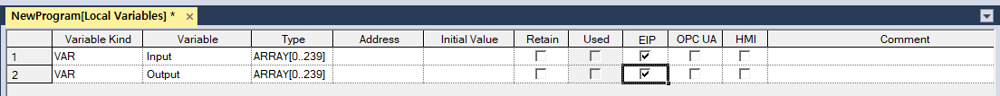 

 

**7. EtherNet/IP 适配器设置**

 

[1] 双击左侧列表中的 EB01 (Hi7 EtherNet/IP 适配器)。 

[2] 按下 EIP 详细设置按钮。 
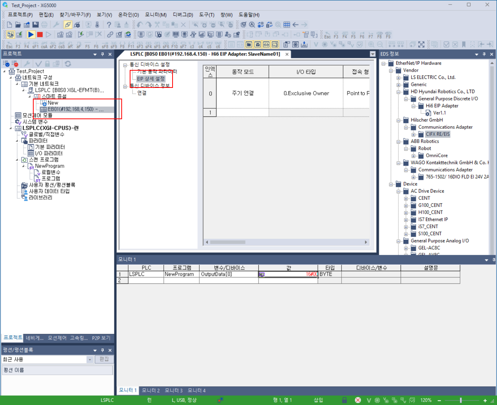 

[3] 请参考下图选择 EtherNet/IP 适配器的设置值。  
- 连接类型
- T2O RPI 范围，O2T RPI 范围
- T2O 输入，O2T 输出大小
- 传输周期
- 超时
- 本地标签，远程标签  
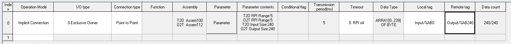  

[4] 点击在线 > 通信模块设置和诊断 > 服务启用。 
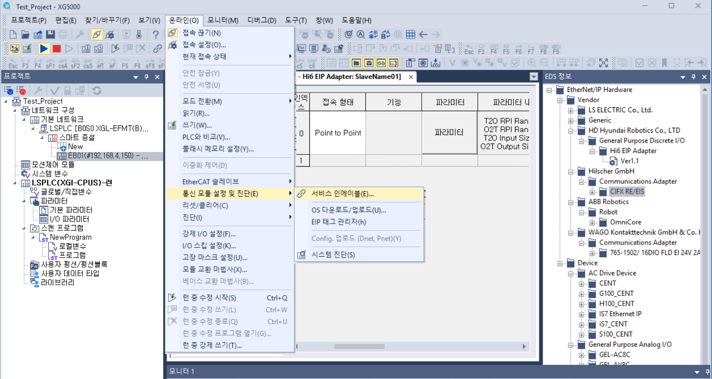 

[5] 勾选 FEnet I/O 服务复选框。 
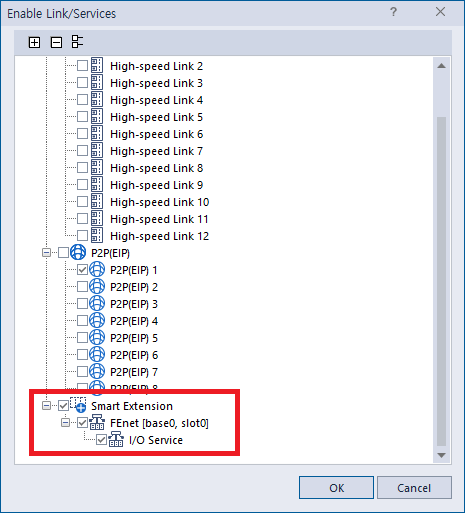 

 

**8. 完成通信设置后的 IO 块分配**

 


   **完成通信设置后，您可以通过分配 IO 块来使用输入/输出信号。请参考 ("[5. 工业通信 IO 读取和写入](../../../5-io-block-allocation.md)").**
