## 4.1 PROFINET ?

 **1. PROFINET**
- PROFINET is an Ethernet-based communication standard for industrial automation.
- It supports real-time data exchange between controllers (PLCs, robot controllers, etc.) and distributed I/O devices (drives, sensors, modules, etc.).

**2. PROFINET Specifications**
- Digital input: 50, 120, and 240 bytes (select one type of byte count)
- Digital output: 50, 120, and 240 bytes (select one type of byte count)
- Safety I/O: 8/8 bytes (activated or deactivated)
- Minimum communication cycle: 1 msec
- Supported communication speed: 10 or 100 Mbps
- Conformance Class: B
- Netload Class: II
- Optional Feature: Legacy, MRP

**3. PROFINET Configuration Procedure**

1) Connection of BD671, PROFINET controller and Hi7 Com
2) GSDML file registration (TIA portal)
3) PROFINET controller settings (TIA portal)
4) Hi7 settings (TP UI)
5) PROFINET communication verification
6) PROFINET I/O signal assignment (FB block settings)

**3.1 Connection of BD671, F-Host and Hi7 Com**

**3.1.1 LAN Cable Connection**
1) Connect the PROFINET controller and BD671 using a LAN cable.
2) Check if the Link LED is blinking.
3) Connect the Hi7 COM’s LAN3 connector and BD671 using a LAN cable.
4) Check if the Link LED is blinking.

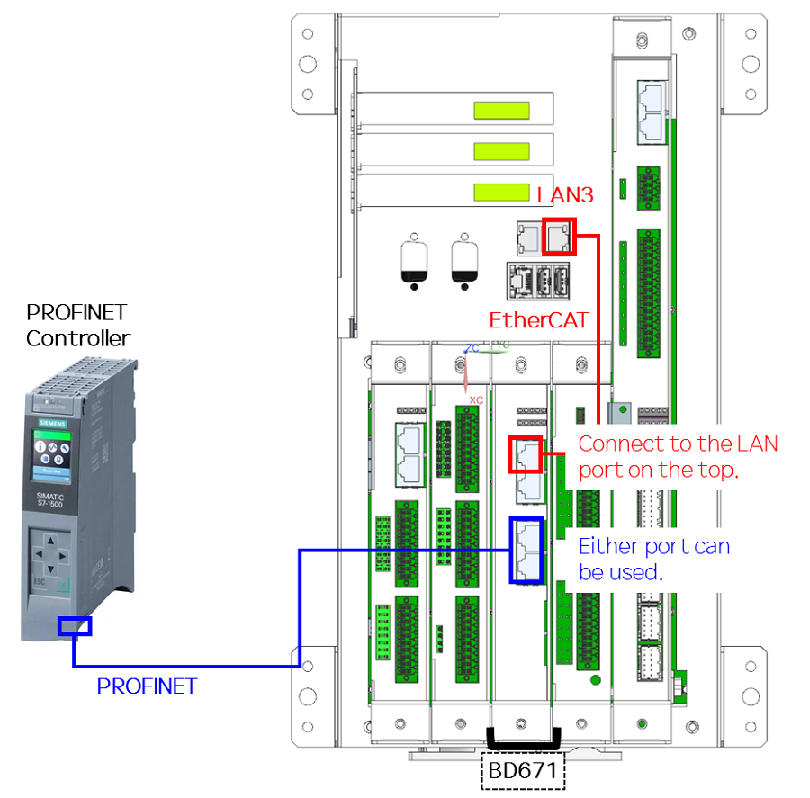

**3.1.2 Hi7 Com Connection Settings**
1) Navigate to the menu as follows: System -> Control Parameters -> Industrial Communication -> EtherCAT Master Settings
2) Configure as shown below.
- EtherCAT Master : ON
- Port : LAN3
3) Select "OptionBD – PROFINET_IO" from the slave list and press the Apply button.
4) Reboot the Hi7 robot controller.
5) After rebooting, check the status of the Run, Communication, Error LEDs.

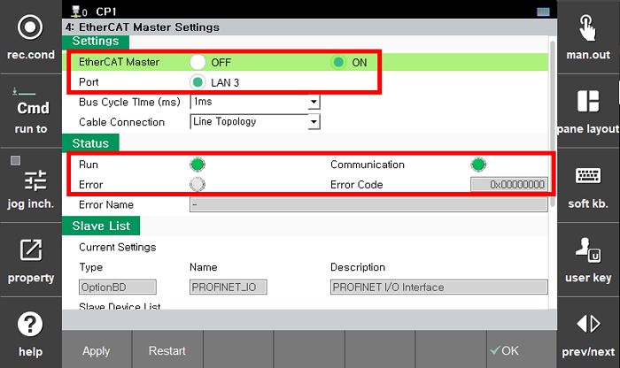
   
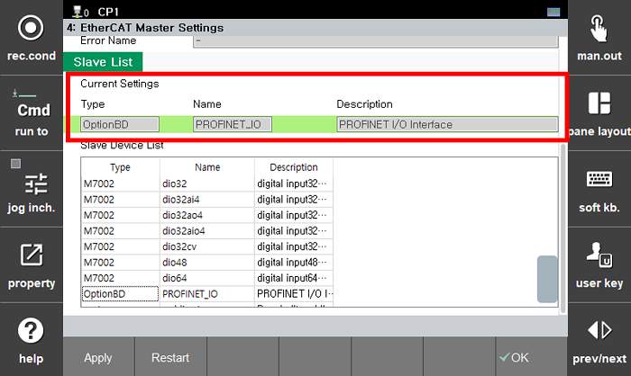

**3.2 GSDML File Registration (TIA portal)**
1) Run the TIA portal.
2) Navigate as shown on the right in the menu: [Options] → [Manage general station description file (GSD)].
3) Click the "…" button and set the directory where the GSDML file is located.
4) Select "GSDML-V2.43-Hyundai-Robotics-HI6-20250418.xml" from the list displayed on the screen and press the [Install] button.
5) Check if it has been registered as a new device in the hardware catalog.  
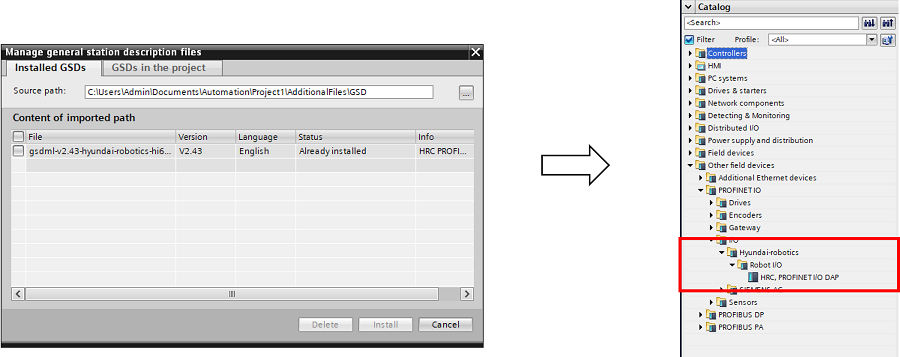

**3.3 PROFINET Controller Settings (TIA portal)**
1) Run the TIA portal and create a new project.
2) Double-click the Device & Network section to open it. 
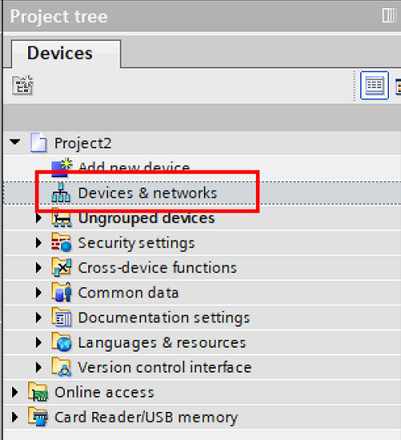

3) Select a controller that supports PROFINET communication (e.g., CPU 1511F-1 PN) and drag it to the network view.
4) Add the device (HRC, PROFINET I/O DAP) added in the previous step from the hardware catalog and drag it to the network view.
5) Connect the two devices by dragging and dropping the LAN ports in the two device figures. 
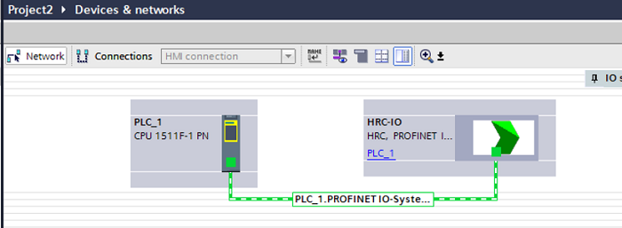

6) Double-click the HRC-IO device in the "Device & Network" screen.
7) Select the desired slot.
8) Drag the desired module (DI, DO, or PROFIsafe I/O) from the catalog on the right and move it to the "Device Overview window." 
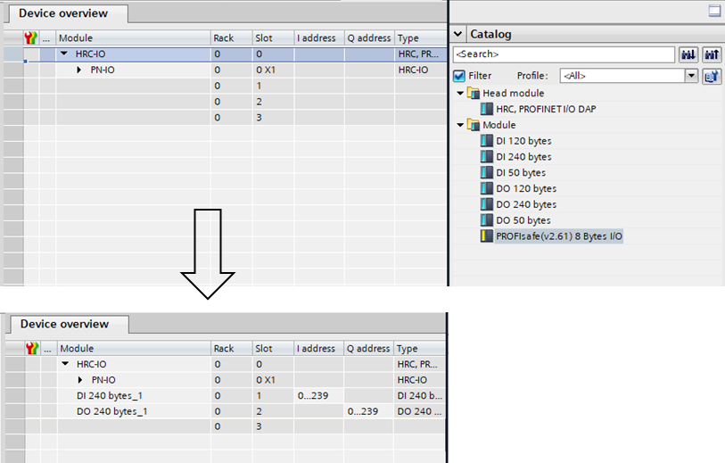

9) Double-click the HRC-IO device in the "Device & Network" screen.
10) Click the HRC-IO device again to open the Settings screen.
11) Navigate to the General tab below.
12) Select Ethernet addresses from the menu on the left.
13) Uncheck "Generate PROFINET device name automatically."
14) Set "PROFINET device name" to "hd-hrc-0" and save. 
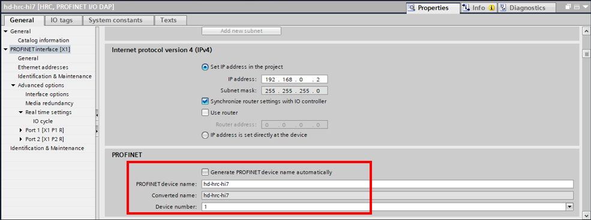

**3.4 Hi7 Settings (TP UI)**
1) Set the parameters to the values below, which are the same as those set in the PNIO controller.
- PROFINET IO Device Name : hd-hrc-0
- Slot 1 : Digital Input : 240
- Slot 2 : Digital Output : 240
- Slot 3 : Safety I/O : No
- (No need to change the IP address.)
2) Press the "Apply" button. 
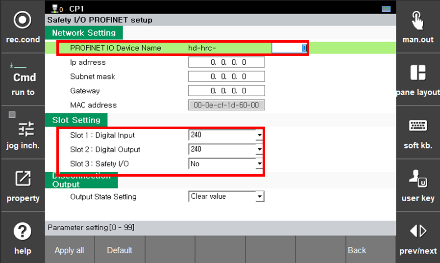

**3.5 PROFINET Communication Verification**
**3.5.1 Ladder Program (TIA portal)**
1) In the Device Overview tab, create a ladder program as shown below and download it to the controller. 
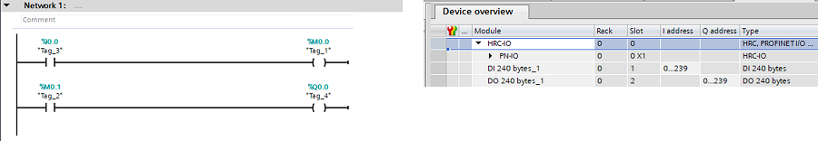
2) After downloading, check if a green checkbox is displayed on the Distribution I/O screen. 
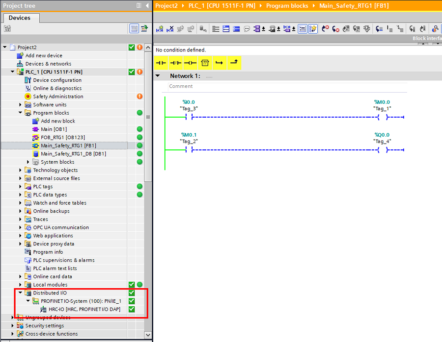

**3.5.2 TP Screen**
In the menu, navigate to System -> Safety System -> Monitoring -> PROFINET Status. 

- Check the status information of each slot.
- Check if the counter continuously increases.

**3.6 PROFINET I/O Signal Assignment (FB block settings)**
1) Navigate to System → Control Parameters → Input/Output Signal Settings → FB Block Assignment
2) Change the block settings to PROFINET I/O as many as needed (up to two).
 (The maximum PROFINET I/O size is 240 bytes and the individual FB block size is 120 bytes. Therefore, **any settings exceeding two will be ignored.**) 
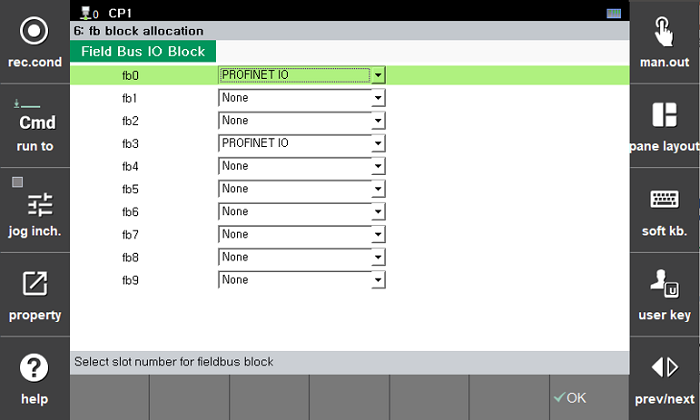

3) Additionally, navigate to the Condition Settings menu and check if the PLC operation mode is OFF. 
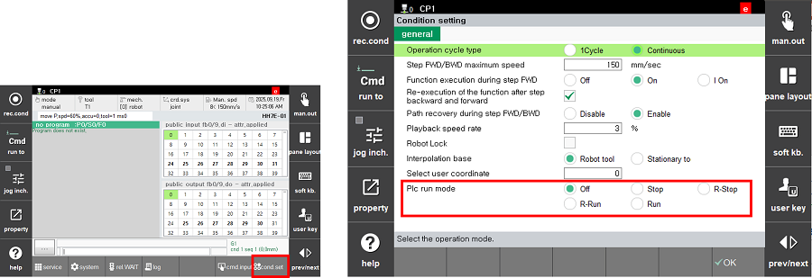
4) Check the input/output signals on the TIA portal screen and General I/O screen. 
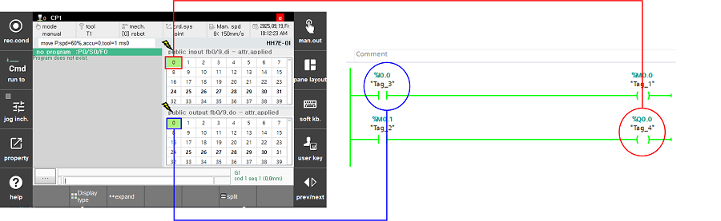
