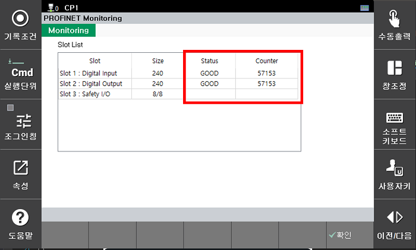
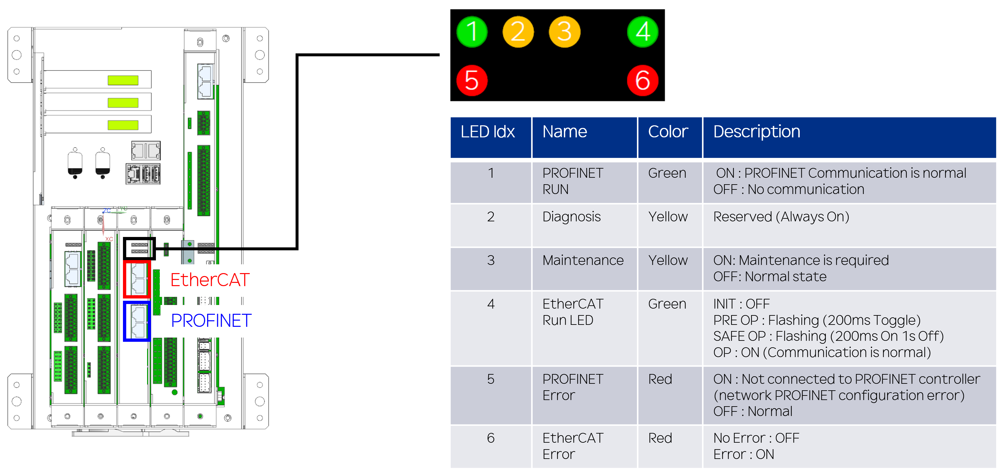

## 5.3 PROFINET 모니터링

**\[시스템 > 8: 안전 시스템 > 3: 모니터링 > 4: PROFINET 상태]** 메뉴를 선택하여 PROFINET 상태를 슬롯별로 모니터링 할 수 있습니다.

</img>
<em>
PROFINET 상태 모니터링 화면
</em>

- 크기 : 설정된 I/O Size를 의미(단위 : 바이트)
- 상태 : BAD(사용안함 or 통신이상), GOOD(통신 정상)
- 카운터 : I/O 갱신 횟수(지속 증가시 통신 정상)

</img>
<em>
BD671(PROFINET) 
</em>

