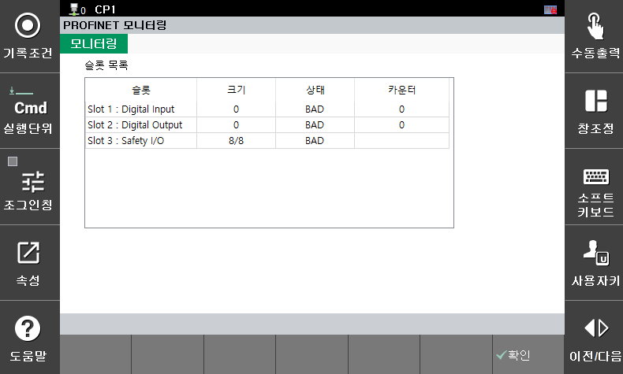

## 5.3 PROFINET 监控

通过选择 **\[System > 8: Safety System > 3: Monitoring > 4: PROFINET Status]** 菜单，您可以按槽监控 PROFINET 状态。

</img>
<em>
PROFINET 状态监控屏幕
</em>

- 大小：指示设定的 I/O 大小（单位：字节）。
- 状态：BAD（未使用或通信错误），GOOD（通信正常）
- 计数器：I/O 更新计数（如果持续增加则通信正常）

</img>
<em>
BD671(PROFINET) 
</em>

