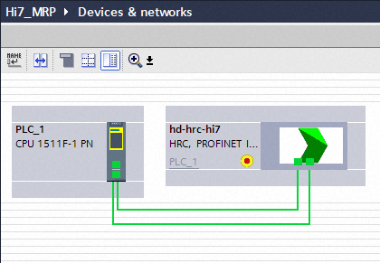
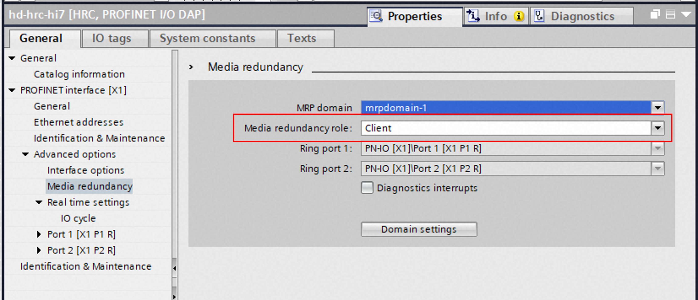
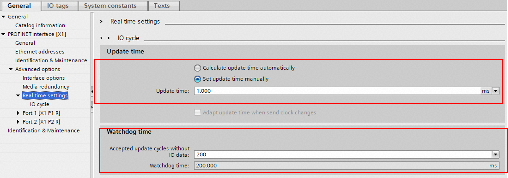

## 4.3 MRP Settings

BD671 can be configured as an MRP Client to use the cable redundancy function.
In addition to the basic PROFINET settings, configure the following settings to enable the MRP function.

1) Topology setting

</img>
<em>
Topology 
</em>

2) MRP Client setting

</img>
<em>
MRP Client 
</em>

3) Watchdog Time Setting (Set to 200 ms or longer)

 - The Watchdog Time must be set to 200 ms or longer to allow the MRP Manager to perform network topology reconfiguration (see figure).

</img>
<em>
Watchdog Time 
</em>

